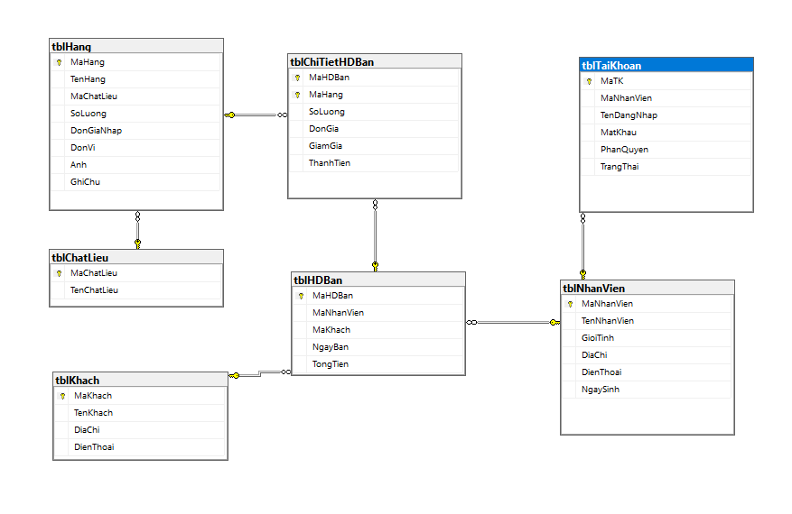

# 🏪 ỨNG DỤNG QUẢN LÝ BÁN HÀNG

## 📋 Mục lục
- [Giới thiệu](#-giới-thiệu)
- [Tính năng chính](#-tính-năng-chính)
- [Công nghệ sử dụng](#-công-nghệ-sử-dụng)
- [Yêu cầu hệ thống](#-yêu-cầu-hệ-thống)
- [Cài đặt](#-cài-đặt)
- [Cấu trúc dự án](#-cấu-trúc-dự-án)
- [Hướng dẫn sử dụng](#-hướng-dẫn-sử-dụng)
- [Phân quyền người dùng](#-phân-quyền-người-dùng)
- [Cơ sở dữ liệu](#-cơ-sở-dữ-liệu)
- [Tác giả](#-tác-giả)

## 📖 Giới thiệu

**Ứng dụng Quản lý Bán hàng** là một phần mềm desktop được phát triển bằng Python với giao diện đồ họa Tkinter, kết nối với cơ sở dữ liệu SQL Server. Ứng dụng được thiết kế để hỗ trợ các cửa hàng bán lẻ trong việc quản lý hoạt động kinh doanh hàng ngày một cách hiệu quả và chuyên nghiệp.

### 🎯 Mục tiêu dự án
- Số hóa quy trình quản lý bán hàng
- Tối ưu hóa việc theo dõi hàng tồn kho
- Quản lý thông tin khách hàng và nhân viên
- Tạo báo cáo doanh thu chi tiết
- Phân quyền người dùng rõ ràng (Admin, Quản lý, Nhân viên)

## ✨ Tính năng chính

### 📊 Bảng điều khiển (Dashboard)
- Hiển thị thống kê tổng quan theo thời gian thực
- Tổng doanh thu, số đơn hàng, sản phẩm, khách hàng
- Top sản phẩm bán chạy nhất
- Thông tin phiên làm việc của người dùng
- Giao diện KPI Cards trực quan

### 🛒 Quản lý Hàng hóa
- Thêm, sửa, xóa sản phẩm với validation đầy đủ
- Tìm kiếm và lọc sản phẩm theo tên hàng
- Quản lý chất liệu/danh mục sản phẩm qua Combobox
- Cập nhật số lượng tồn kho tự động
- Upload và hiển thị hình ảnh sản phẩm (Pillow)
- Hiển thị dữ liệu trong TreeView với giao diện đẹp mắt
- Xử lý bất đồng bộ với Threading
- Double-click để chỉnh sửa nhanh

### 👤 Quản lý Khách hàng
- Lưu trữ thông tin khách hàng đầy đủ (Tên, Địa chỉ, Điện thoại)
- Tìm kiếm khách hàng theo tên nhanh chóng
- Giao diện form 2 cột tối ưu
- Hiển thị dữ liệu xen kẽ màu (oddrow/evenrow)
- Validation số điện thoại và thông tin bắt buộc
- Xử lý bất đồng bộ với Threading

### 👨‍💼 Quản lý Nhân viên
- Quản lý thông tin nhân viên đầy đủ (Tên, Giới tính, Ngày sinh, SĐT, Địa chỉ)
- **Chọn ngày sinh với DatePicker (tkcalendar)** tiện lợi
- Combobox giới tính (Nam, Nữ, Khác)
- Tìm kiếm theo tên hoặc số điện thoại
- Phân quyền truy cập hệ thống
- Xử lý bất đồng bộ với Threading
- **Chỉ Admin mới có quyền truy cập**

### 💰 Lập Hóa đơn Bán hàng
- Tạo hóa đơn bán hàng nhanh chóng với giao diện trực quan
- **Giỏ hàng (Cart)** hiển thị chi tiết từng sản phẩm
- Tự động điền thông tin nhân viên từ phiên đăng nhập
- Chọn khách hàng từ Combobox
- Chọn sản phẩm và tự động cập nhật đơn giá
- Tính toán giảm giá linh hoạt theo phần trăm (%)
- **Tự động tính thành tiền** = SL × Đơn giá × (1 - Giảm%)
- Hiển thị **Tổng tiền hóa đơn** theo thời gian thực
- **Cập nhật tồn kho tự động** khi lưu hóa đơn
- Transaction handling đảm bảo dữ liệu nhất quán

### 📜 Báo cáo Doanh thu
- **Báo cáo chi tiết hóa đơn và mặt hàng** trong một bảng
- Lọc theo khoảng thời gian với **DatePicker (tkcalendar)**
- Lọc theo nhân viên cụ thể hoặc tất cả
- Hiển thị chi tiết: Mã HĐ, Ngày, NV, Khách, Mã hàng, Tên hàng, SL, Đơn giá, Giảm giá
- **Tổng hợp tự động**: Số lượng hóa đơn, Số lượng mặt hàng, Doanh thu gộp
- **Export dữ liệu ra file CSV** với đầy đủ thông tin
- Giao diện summary frame với màu sắc nổi bật
- Xử lý bất đồng bộ với Threading

### ⚙️ Quản lý Tài khoản
- Tạo, sửa, xóa tài khoản người dùng
- **Giao diện bảo mật** với App Bar tối màu
- Liên kết tài khoản với nhân viên qua Combobox
- **Mật khẩu hiển thị dạng ● (masked)** với nền tối
- Phân quyền: ADMIN (0), Quản lý (1), Nhân viên (2)
- Trạng thái tài khoản: Hoạt động (1), Bị khóa (0)
- Tìm kiếm theo tên đăng nhập hoặc tên nhân viên
- **Chỉ Admin có quyền truy cập module này**

## 🔧 Công nghệ sử dụng

| Công nghệ | Mục đích |
|-----------|----------|
| **Python 3.8+** | Ngôn ngữ lập trình chính |
| **Tkinter** | Xây dựng giao diện đồ họa (GUI) |
| **ttk (Themed Tkinter)** | Widget nâng cao (Treeview, Combobox) |
| **pyodbc** | Kết nối và tương tác với SQL Server |
| **SQL Server** | Hệ quản trị cơ sở dữ liệu |
| **Threading** | Xử lý bất đồng bộ, tránh đơ UI |
| **tkcalendar** | DatePicker cho chọn ngày tháng |
| **Pillow (PIL)** | Xử lý hình ảnh sản phẩm |
| **csv** | Export dữ liệu ra file CSV |
| **datetime** | Xử lý ngày tháng, timestamp |


## 💻 Yêu cầu hệ thống

### Phần mềm cần thiết
- **Python**: Phiên bản 3.8 trở lên
- **SQL Server**: Express 2017 trở lên (hoặc bất kỳ phiên bản nào)
- **SQL Server Management Studio (SSMS)**: Để quản lý database
- **ODBC Driver for SQL Server**: Driver 17 hoặc 18

### Thư viện Python
```
pyodbc>=4.0.0
tkcalendar>=1.6.0
Pillow>=9.0.0
```

**Lưu ý**: Module `csv`, `threading`, `datetime` đã có sẵn trong Python standard library.

## 📥 Cài đặt

### Bước 1: Clone hoặc Download dự án
```bash
git clone https://github.com/ltanh-glitch/DTH235607_LeTuanAnh_DH24TH1_NHOM1_TO1_NHOMDOAN03_NOPDOAN_PYTHON.git
cd DoAn_QuanLyBanHang
```

### Bước 2: Cài đặt thư viện Python
```bash
pip install pyodbc tkcalendar Pillow
```

Hoặc cài đặt từ file requirements (nếu có):
```bash
pip install -r requirements.txt
```

### Bước 3: Cấu hình SQL Server

1. Mở **SQL Server Management Studio (SSMS)**
2. Chạy file script: `Database/sales management.sql`
3. Database `QuanLyBanHang` sẽ được tạo tự động với dữ liệu mẫu

### Bước 4: Cấu hình kết nối Database

Mở file `src/connect_db.py` và cập nhật thông tin kết nối:

```python
def get_connection():
    conn_str = (
        "DRIVER={ODBC Driver 18 for SQL Server};"
        "SERVER=LAPTOP-TUANANH;"  # Thay đổi tên server
        "DATABASE=QuanLyBanHang;"
        "Trusted_Connection=yes;"
    )
    return pyodbc.connect(conn_str)
```

**Lưu ý**: Thay `YOUR_SERVER_NAME` bằng tên SQL Server của bạn (ví dụ: `localhost` hoặc `.\SQLEXPRESS`)

### Bước 5: Chạy ứng dụng
```bash
cd src
python main_form.py
```

## 📁 Cấu trúc dự án

```
DoAn_QuanLyBanHang/
│
├── Database/
│   └── sales management.sql          # Script tạo database và dữ liệu mẫu
│
├── src/
│   ├── main_form.py                  # Form chính với sidebar và dashboard
│   ├── login_form.py                 # Form đăng nhập
│   ├── splash_form.py                # Màn hình chào mừng
│   ├── auth.py                       # Xử lý xác thực và phân quyền
│   ├── connect_db.py                 # Kết nối cơ sở dữ liệu
│   ├── product_management_form.py    # Quản lý hàng hóa
│   ├── customer_management_form.py   # Quản lý khách hàng
│   ├── employee_management_form.py   # Quản lý nhân viên
│   ├── account_management_form.py    # Quản lý tài khoản
│   ├── sales_invoice_form.py         # Lập hóa đơn bán hàng
│   └── revenue_report_form.py        # Báo cáo doanh thu
│
├── BaoCao_Word/                      # Tài liệu báo cáo đồ án
│
└── README.md                         # File này
```

## 📖 Hướng dẫn sử dụng

### Đăng nhập lần đầu

Sau khi chạy ứng dụng, sử dụng một trong các tài khoản mẫu:

| Tài khoản | Mật khẩu | Quyền hạn |
|-----------|----------|-----------|
| `admin` | `admin123` | ADMIN (Full quyền) |
| `quanly` | `quanly123` | QUẢN LÝ |
| `nhanvien1` | `nhanvien123` | NHÂN VIÊN |

### Quy trình làm việc cơ bản

1. **Đăng nhập** với tài khoản phù hợp
2. **Quản lý Hàng hóa**: Nhập thông tin sản phẩm vào kho
3. **Quản lý Khách hàng**: Thêm thông tin khách hàng mới
4. **Lập Hóa đơn**: Tạo hóa đơn bán hàng cho khách
5. **Báo cáo**: Xem báo cáo doanh thu theo nhu cầu

## 🔐 Phân quyền người dùng

### ADMIN (PhanQuyen = 0)
- ✅ Toàn quyền truy cập tất cả chức năng
- ✅ Quản lý nhân viên
- ✅ Quản lý tài khoản
- ✅ Xem tất cả báo cáo tài chính

### QUẢN LÝ (PhanQuyen = 1)
- ✅ Quản lý hàng hóa
- ✅ Quản lý khách hàng
- ✅ Lập hóa đơn bán hàng
- ✅ Xem báo cáo doanh thu
- ❌ Không quản lý nhân viên và tài khoản

### NHÂN VIÊN (PhanQuyen = 2)
- ✅ Xem thông tin hàng hóa (chỉ đọc)
- ✅ Quản lý khách hàng
- ✅ Lập hóa đơn bán hàng
- ❌ Không xem báo cáo tài chính
- ❌ Không quản lý nhân viên và tài khoản

## 🎨 Tính năng kỹ thuật nổi bật

### 1. **Threading (Đa luồng)**
- Tất cả các thao tác database đều sử dụng Threading
- Tránh đơ giao diện khi load dữ liệu lớn
- Status bar hiển thị trạng thái "Đang tải..." khi xử lý

### 2. **DatePicker với tkcalendar**
- Module Quản lý Nhân viên: Chọn ngày sinh trực quan
- Module Báo cáo Doanh thu: Lọc theo khoảng thời gian
- Format ngày: `yyyy-mm-dd` theo chuẩn SQL Server
- Locale tiếng Việt (`vi_VN`)

### 3. **TreeView với Style tùy chỉnh**
- Hiển thị dữ liệu dạng bảng chuyên nghiệp
- Xen kẽ màu (oddrow/evenrow) dễ đọc
- Double-click để chỉnh sửa nhanh
- Scrollbar tự động khi dữ liệu nhiều

### 4. **State Management (Quản lý trạng thái)**
- 3 trạng thái: VIEW, ADD, EDIT
- Tự động enable/disable các nút phù hợp
- Readonly fields khi cần thiết

### 5. **Transaction Handling**
- Module Hóa đơn sử dụng Transaction
- Rollback tự động nếu có lỗi
- Đảm bảo tính toàn vẹn dữ liệu

### 6. **Export dữ liệu**
- Module Báo cáo: Export ra CSV với encoding UTF-8-BOM
- Tự động mở file sau khi xuất
- Tên file có timestamp để dễ quản lý

### 7. **UI/UX Design**
- Color palette nhất quán (Material Design)
- Icon Emoji làm giao diện sinh động
- Responsive layout với grid và pack
- LabelFrame phân nhóm rõ ràng

## 🗄️ Cơ sở dữ liệu



### Sơ đồ quan hệ chính

```
tblChatLieu (Chất liệu)
    ↓
tblHang (Sản phẩm)
    ↓
tblChiTietHDBan (Chi tiết hóa đơn)
    ↑
tblHDBan (Hóa đơn) ← tblKhach (Khách hàng)
    ↑
tblNhanVien (Nhân viên) → tblTaiKhoan (Tài khoản)
```

### Các bảng chính

| Bảng | Mô tả |
|------|-------|
| `tblChatLieu` | Danh mục chất liệu/loại hàng |
| `tblHang` | Thông tin sản phẩm/hàng hóa |
| `tblKhach` | Thông tin khách hàng |
| `tblNhanVien` | Thông tin nhân viên |
| `tblTaiKhoan` | Tài khoản đăng nhập |
| `tblHDBan` | Hóa đơn bán hàng |
| `tblChiTietHDBan` | Chi tiết các sản phẩm trong hóa đơn |


## ❓ Troubleshooting (Xử lý lỗi thường gặp)

### Lỗi: "Module tkcalendar not found"
```bash
pip install tkcalendar
```

### Lỗi: "Can't connect to SQL Server"
1. Kiểm tra SQL Server đã chạy chưa
2. Kiểm tra tên Server trong `connect_db.py`
3. Thử dùng `localhost` hoặc `.\SQLEXPRESS`
4. Kiểm tra ODBC Driver đã cài đặt

### Lỗi: "Login failed for user"
1. Đảm bảo sử dụng `Trusted_Connection=yes` (Windows Authentication)
2. Hoặc thêm `UID` và `PWD` nếu dùng SQL Authentication

### Lỗi encoding tiếng Việt
- Đảm bảo file Python có `# -*- coding: utf-8 -*-` ở đầu
- Export CSV sử dụng `utf-8-sig` để tương thích Excel

### Giao diện bị lỗi font
- Cài đặt font "Segoe UI" hoặc "Arial" trên hệ thống
- Thay đổi font trong code nếu cần

## 🚀 Tính năng nâng cao (Đang phát triển)

- [ ] Quản lý nhập hàng từ nhà cung cấp
- [ ] Export Excel nâng cao (openpyxl, xlsxwriter)
- [ ] Tạo báo cáo PDF với ReportLab
- [ ] In hóa đơn trực tiếp từ máy in
- [ ] Tích hợp quét mã vạch (barcode scanner)
- [ ] Gửi SMS/Email thông báo cho khách hàng
- [ ] Dashboard với biểu đồ Matplotlib/Plotly
- [ ] Sao lưu và khôi phục dữ liệu tự động
- [ ] Chế độ Dark Mode
- [ ] Multi-language support (i18n)
- [ ] Logging và audit trail
- [ ] API REST để tích hợp mobile app

## 🤝 Đóng góp

Mọi đóng góp đều được hoan nghênh! Vui lòng:

1. Fork dự án
2. Tạo branch mới (`git checkout -b feature/TinhNangMoi`)
3. Commit thay đổi (`git commit -m 'Thêm tính năng mới'`)
4. Push lên branch (`git push origin feature/TinhNangMoi`)
5. Tạo Pull Request


## 👨‍💻 Tác giả

**Lê Tuấn Anh**
- MSSV: DTH235607
- Lớp: DH24TH1
- Nhóm: NHOM1_TO1_NHOMDOAN03
- Email: [anh_dth235607@student.agu.edu.vn]
- GitHub: [@ltanh-glitch](https://github.com/ltanh-glitch)

**Trần Vũ Duy**
- MSSV: DTH235633
- Lớp: DH24TH1
- Nhóm: NHOM1_TO1_NHOMDOAN03
- Email: [duy_dth235633@student.agu.edu.vn]

---

## 🙏 Lời cảm ơn

- Cảm ơn Thầy và các bạn đã ghé thăm

---

**⭐ Nếu bạn thấy dự án hữu ích, hãy cho một Star nhé!**

📅 **Cập nhật lần cuối**: Tháng 11, 2025
